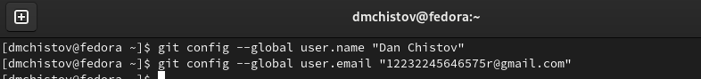
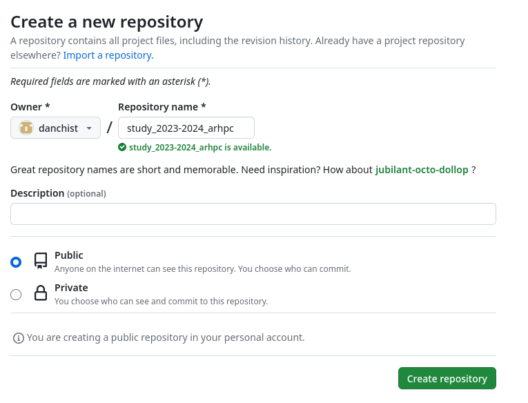
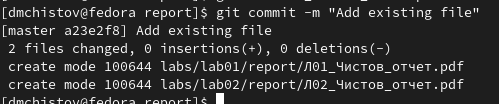

---
## Front matter
title: "Отчёт по лабораторной работе №2"
subtitle: "Дисциплина: Архитектура компьютера"
author: "Чистов Даниил Максимович"

## Generic otions
lang: ru-RU
toc-title: "Содержание"

## Bibliography
bibliography: bib/cite.bib
csl: pandoc/csl/gost-r-7-0-5-2008-numeric.csl

## Pdf output format
toc: true # Table of contents
toc-depth: 2
lof: true # List of figures
lot: false # List of tables
fontsize: 12pt
linestretch: 1.5
papersize: a4
documentclass: scrreprt
## I18n polyglossia
polyglossia-lang:
  name: russian
  options:
	- spelling=modern
	- babelshorthands=true
polyglossia-otherlangs:
  name: english
## I18n babel
babel-lang: russian
babel-otherlangs: english
## Fonts
mainfont: PT Serif
romanfont: PT Serif
sansfont: PT Sans
monofont: PT Mono
mainfontoptions: Ligatures=TeX
romanfontoptions: Ligatures=TeX
sansfontoptions: Ligatures=TeX,Scale=MatchLowercase
monofontoptions: Scale=MatchLowercase,Scale=0.9
## Biblatex
biblatex: true
biblio-style: "gost-numeric"
biblatexoptions:
  - parentracker=true
  - backend=biber
  - hyperref=auto
  - language=auto
  - autolang=other*
  - citestyle=gost-numeric
## Pandoc-crossref LaTeX customization
figureTitle: "Рис."
tableTitle: "Таблица"
listingTitle: "Листинг"
lofTitle: "Список иллюстраций"
lotTitle: "Список таблиц"
lolTitle: "Листинги"
## Misc options
indent: true
header-includes:
  - \usepackage{indentfirst}
  - \usepackage{float} # keep figures where there are in the text
  - \floatplacement{figure}{H} # keep figures where there are in the text
---

# Цель работы

Целью работы является изучить идеологию и применение средств контроля версий. Приобрести практические навыки по работе с системой git.

# Задание

1. Базовая настройка git
2. Создание SSH ключа
3. Создание рабочего пространства и репозитория курса на основе шаблона
4. Создание репозитория курса на основе шаблона
5. Настройка каталога курса
6. Выполнение самостоятельной работы

# Выполнение лабораторной работы

## 1. Базовая настройка git

Мной ранее был создан аккаунт в системе github, требуется сделать предварительную конфигурацию. Открываю терминал и ввожу следующие команды, указав своё имя и email, которые связан с репоизторием (рис. [-@fig:001]):
git config --global user.name "Dan Chistov"
git config --global user.email "12232245646575r@gmail.com"

{#fig:001 width=100%}

Настрою utf-8 в выводе сообщений git, благодаря параметру “core.quotepath" (рис. [-@fig:002]).

{#fig:002 width=100%}

Задам имя начальной ветки – “master” (рис. [-@fig:003]).

{#fig:003 width=100%}

Для корректного считывания текста ОС Fedora Linux системой git пропишу параметр “autocrif” и “safecrif” рис. [-@fig:004]).

{#fig:004 width=100%}

## 2. Создание SSH ключа

Во время пользования системой git необходимо сгенерировать несколько ключей, для того чтобы идентифицировать пользователя. Это можно сделать командой “ssh-keygen” (рис. [-@fig:005]).

{#fig:005 width=100%}

Требуется привязать сгенерированный ключ к системе git. Для этого захожу на сайт github.org под своей учётной записью и перехожу в меню “Settings” (рис. [-@fig:006]).

{#fig:006 width=100%}

Затем перехожу во вкладку “SSH and GPG keys” и нажимаю кнопку “New SSH key” (рис. [-@fig:007]).

{#fig:007 width=100%}

Затем прочитываю данные ключа командой «cat», а потом копирую сгенерированный ключ командой «xclip -sel clip» (рис. [-@fig:008]) и вставляю в указанное поле, после чего нажимаю кнопку “Add SSH key” (рис. [-@fig:009]).

{#fig:008 width=100%}

{#fig:009 width=100%}

Ключ был добавлен успешно (рис. [-@fig:010]).

{#fig:010 width=100%}

## 3. Создание рабочего пространства и репозитория курса на основе шаблона

Создам каталог для предмета «Архитектура Компьютера» следующей командой (рис. [-@fig:011]).
mkdir -p ~/work/study/2023-2024/"Архитектура компьютера"

{#fig:011 width=100%}

## 4. Создание репозитория курса на основе шаблона

Создам репозиторий для выполнения лабораторных работ через web-интерфейс github. Перехожу по следующей ссылке на шаблон (рис. [-@fig:012]).
https://github.com/yamadharma/course-directory-student-template 

{#fig:012 width=100%}

Выбираю "Use this template" (рис. [-@fig:013]).

{#fig:013 width=100%}

Задаю имя репозитория «study_2023–2024_arhpc» и нажимаю кнопку «Create repository from this template» (рис. [-@fig:014]).

{#fig:014 width=100%}

Открываю терминал и перехожу в каталог курса с помощью команды «cd» (рис. [-@fig:015]).

{#fig:015 width=100%}

Затем клонирую созданный мной ранее репозиторий командой «git clone» (рис. [-@fig:016]).

{#fig:016 width=100%}

## 5. Настройка каталога курса

Перейду в каталог курса, благодаря команде «cd» (рис. [-@fig:017]).

{#fig:017 width=100%}

Удаляю ненужные файлы с помощью команды «rm» (рис. [-@fig:018]).

{#fig:018 width=100%}

Создаю необходимые каталоги, благодаря команде «echo» (рис. [-@fig:019]).

{#fig:019 width=100%}

Отправляю файлы на сервер Github (рис. [-@fig:020], [-@fig:021]).

{#fig:020 width=100%}

{#fig:021 width=100%}

Проверяю правильность выполнения задания. Действительно, созданный репозиторий можно найти с помощью файлового менеджера на диске компьютера (рис. [-@fig:022]), а также в системе GitHub (рис. [-@fig:023]).

{#fig:022 width=100%}

{#fig:023 width=100%}

## 6. Выполнение самостоятельной работы

По завершении выполнения данного отчёта, помещу его в директорию по адресу “labs/lab02/report” (рис. [-@fig:024], [-@fig:025]). Таким же методом помещу отчёт выполнения Лабораторной работы №1 по адресу “labs/lab01/report” (Рис. [-@fig:026], Рис. [-@fig:027]).

{#fig:024 width=100%}

{#fig:025 width=100%}

{#fig:026 width=100%}

{#fig:027 width=100%}

Далее, с помощью команды «git add» добавляю в коммит новые файлы (Л01_Чистов_отчёт и Л02_Чистов_отчёт) (Рис. [-@fig:028], Рис. [-@fig:029])

{#fig:028 width=100%}

{#fig:029 width=100%}

Затем в консоли ввожу команду «git commit -m “…”», таким образом я заявляю о внесённых изменениях (Рис. [-@fig:030]).

{#fig:030 width=100%}

После этого ввожу команду «git push -f origin master», так я вношу все свои изменения в центральный репозиторий (Рис. [-@fig:031]).

{#fig:031 width=100%}

Задание выполнено успешно, в моём репозитории на сайте GitHub.com появились отчёты лабораторных работ (Рис. [-@fig:032], Рис. [-@fig:033]).

{#fig:032 width=100%}

{#fig:033 width=100%}

# Выводы

При выполнении работы я изучил идеологию и применение системы контроля версий, а также приобрёл практические навыки в работе с системой git.

# Список литературы{.unnumbered}

[Архитектура компьютеров (Лабораторная работа 2)](https://esystem.rudn.ru/pluginfile.php/2089082/mod_resource/content/0/%D0%9B%D0%B0%D0%B1%D0%BE%D1%80%D0%B0%D1%82%D0%BE%D1%80%D0%BD%D0%B0%D1%8F%20%D1%80%D0%B0%D0%B1%D0%BE%D1%82%D0%B0%20%E2%84%962.%20%D0%A1%D0%B8%D1%81%D1%82%D0%B5%D0%BC%D0%B0%20%D0%BA%D0%BE%D0%BD%D1%82%D1%80%D0%BE%D0%BB%D1%8F%20%D0%B2%D0%B5%D1%80%D1%81%D0%B8%D0%B9%20Git.pdf)
