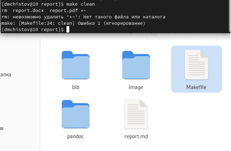
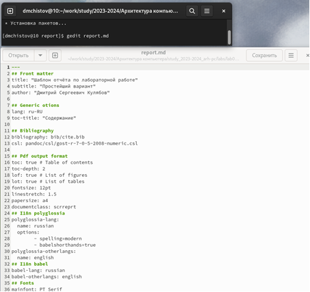

---
## Front matter
title: "Отчёт по лабораторной работе №3"
subtitle: "Дисциплина: Архитектура компьютера"
author: "Чистов Даниил Максимович"

## Generic otions
lang: ru-RU
toc-title: "Содержание"

## Bibliography
bibliography: bib/cite.bib
csl: pandoc/csl/gost-r-7-0-5-2008-numeric.csl

## Pdf output format
toc: true # Table of contents
toc-depth: 2
lof: true # List of figures
fontsize: 12pt
linestretch: 1.5
papersize: a4
documentclass: scrreprt
## I18n polyglossia
polyglossia-lang:
  name: russian
  options:
	- spelling=modern
	- babelshorthands=true
polyglossia-otherlangs:
  name: english
## I18n babel
babel-lang: russian
babel-otherlangs: english
## Fonts
mainfont: PT Serif
romanfont: PT Serif
sansfont: PT Sans
monofont: PT Mono
mainfontoptions: Ligatures=TeX
romanfontoptions: Ligatures=TeX
sansfontoptions: Ligatures=TeX,Scale=MatchLowercase
monofontoptions: Scale=MatchLowercase,Scale=0.9
## Biblatex
biblatex: true
biblio-style: "gost-numeric"
biblatexoptions:
  - parentracker=true
  - backend=biber
  - hyperref=auto
  - language=auto
  - autolang=other*
  - citestyle=gost-numeric
## Pandoc-crossref LaTeX customization
figureTitle: "Рис."
listingTitle: "Листинг"
lofTitle: "Список иллюстраций"
lolTitle: "Листинги"
## Misc options
indent: true
header-includes:
  - \usepackage{indentfirst}
  - \usepackage{float} # keep figures where there are in the text
  - \floatplacement{figure}{H} # keep figures where there are in the text
---

# Цель работы

Целью работы является освоение процедуры оформления отчетов с помощью легковесного языка разметки Markdown.

# Задание

1. Заполнение отчёта по выполнению лабораторной работы №3 с помошью языка разметки Markdown.
2. Выполнение задания для самостоятельной работы.

# Теоретическое введение

Markdown - легковесный язык разметки, созданный с целью обозначения форматирования в простом тексте, с максимальным сохранением его читаемости человеком, и пригодный для машинного преобразования в языки для продвинутых публикаций. Внутритекстовые формулы делаются аналогично формулам LaTeX. В Markdown вставить изображение в документ можно с помощью непосредственного указания адреса изображения. Синтаксис Markdown для встроенной ссылки состоит из части [link text], представляющей текст гиперссылки, и части (file-name.md) – URL-адреса или имени файла, на который дается ссылка. Markdown поддерживает как встраивание фрагментов кода в предложение, так и их размещение между предложениями в виде отдельных огражденных блоков. Огражденные блоки кода — это простой способ выделить синтаксис для фрагментов кода.

# Выполнение лабораторной работы
## Заполнение отчёта по выполнению лабораторной работы №3

Открываю терминал и перехожу в каталог, сформированный во время выполнения лабораторной работы №2 (рис. @fig:001).

{#fig:001 width=100%}

Благодаря команде «git pull», скачиваю последние изменения (рис. @fig:002).

{#fig:002 width=100%}

Перехожу в каталог для отчётов лабораторной работы №3 (рис. @fig:003).

{#fig:003 width=100%}

Провожу компиляцию шаблона с использованием «Makefile», благодаря команде «make» (рис. @fig:004).

{#fig:004 width=100%}

Воспользуюсь командой «make clean», таким образом удаляю созданные мною ранее (рис. @fig:005).

{#fig:005 width=100%}

Открываю файл report.md с помощью редактора «gedit» и внимательно изучаю его (рис. @fig:006).

{#fig:006 width=100%}

Затем создаю копию файла report.md и называю его «Л03_Чистов_отчёт» (рис. @fig:007).

{#fig:007 width=100%}

Открываю файл «Л03_Чистов_отчёт.md»с помощью утилиты gedit и начинаю заполнять данный отчёт (рис. @fig:008).

{#fig:008 width=100%}

После заполнения отчёта, загружаю его на GitHub.

## Выполнение задания для самостоятельной работы

Задание требует сформировать отчёт лабораторной работы №2 с помощью Markdown.
Перехожу в папку с отчётом по адресу .../labs/lab02/report (рис. @fig:009).

{#fig:009 width=100%}

На случай неприятностей, копирую файл "report.md" и переименовываю его в "Л02_Чистов_Отчёт" (рис. @fig:010).

{#fig:010 width=100%}

С помощью утилиты "gedit" начинаю заполнять отчёт (рис. @fig:011).

{#fig:011 width=100%}

По завершении заполнения компилирую готовый отчёт, с помошью команды make, предварительно удалив ранее созданный отчёт в формате PDF (рис. @fig:012).

{#fig:012 width=100%}

Перед отправкой файлов на GitHub удаляю сгенерированные файлы report.docx и report.pdf (рис. @fig:013).

{#fig:013 width=100%}

Заявляю о внесённых изменениях системе GitHub, благодаря команде git add, после чего сохраняю изменения командой git commit (рис. @fig:014).

{#fig:014 width=100%}

Завершаю работу, отправив изменния командой git push (рис. @fig:015).

{#fig:015 width=100%}

# Выводы

Во время выполнения данной лабораторной работы, мною были освоены навыки работы с системой Markdown, а также закреплены знания при работе с системой Git.

# Список литературы{.unnumbered}

1. [Лабораторная работа №3 ТУИС РУДН](https://esystem.rudn.ru/pluginfile.php/2089083/mod_resource/content/0/%D0%9B%D0%B0%D0%B1%D0%BE%D1%80%D0%B0%D1%82%D0%BE%D1%80%D0%BD%D0%B0%D1%8F%20%D1%80%D0%B0%D0%B1%D0%BE%D1%82%D0%B0%20%E2%84%963.%20%D0%AF%D0%B7%D1%8B%D0%BA%20%D1%80%D0%B0%D0%B7%D0%BC%D0%B5%D1%82%D0%BA%D0%B8%20.pdf)
2. [Основы синтаксиса Markdown (на английском языке)](https://www.markdownguide.org/basic-syntax/)
