---
## Front matter
title: "Отчёт по лабораторной работе №4"
subtitle: "Дисциплина: Архитектура компьютера"
author: "Чистов Даниил Максимович"

## Generic otions
lang: ru-RU
toc-title: "Содержание"

## Bibliography
bibliography: bib/cite.bib
csl: pandoc/csl/gost-r-7-0-5-2008-numeric.csl

## Pdf output format
toc: true # Table of contents
toc-depth: 2
lof: true # List of figures
lot: false # List of tables
fontsize: 12pt
linestretch: 1.5
papersize: a4
documentclass: scrreprt
## I18n polyglossia
polyglossia-lang:
  name: russian
  options:
	- spelling=modern
	- babelshorthands=true
polyglossia-otherlangs:
  name: english
## I18n babel
babel-lang: russian
babel-otherlangs: english
## Fonts
mainfont: PT Serif
romanfont: PT Serif
sansfont: PT Sans
monofont: PT Mono
mainfontoptions: Ligatures=TeX
romanfontoptions: Ligatures=TeX
sansfontoptions: Ligatures=TeX,Scale=MatchLowercase
monofontoptions: Scale=MatchLowercase,Scale=0.9
## Biblatex
biblatex: true
biblio-style: "gost-numeric"
biblatexoptions:
  - parentracker=true
  - backend=biber
  - hyperref=auto
  - language=auto
  - autolang=other*
  - citestyle=gost-numeric
## Pandoc-crossref LaTeX customization
figureTitle: "Рис."
tableTitle: "Таблица"
listingTitle: "Листинг"
lofTitle: "Список иллюстраций"
lotTitle: "Список таблиц"
lolTitle: "Листинги"
## Misc options
indent: true
header-includes:
  - \usepackage{indentfirst}
  - \usepackage{float} # keep figures where there are in the text
  - \floatplacement{figure}{H} # keep figures where there are in the text
---

# Цель работы

Цель работы - освоить процедуры компиляции и сборки программ, написанных на ассемблере NASM.

# Задание

1. Выполнение лабораторной работы
2. Задание для самостоятельной работы

# Выполнение лабораторной работы

## Программа Hello world!

Перехожу в папку репозитория и создаю директорию под названием "lab04" (рис. @fig:001).

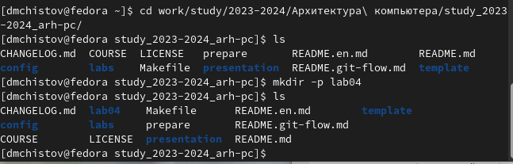{#fig:001 width=100%}

Перехожу в созданную мной директорию и создаю файл "hello.asm" (рис. @fig:002).

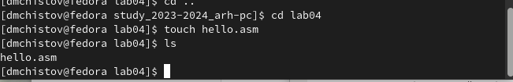{#fig:002 width=100%}

Открываю файл "hello.asm" редактором "mcedit "и вставляю в него код из документа по лабораторной работы (рис. @fig:003).

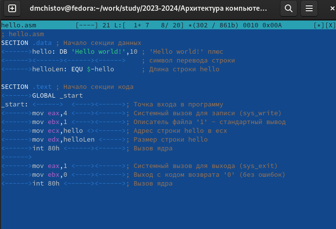{#fig:003 width=100%}

## Транслятор NASM

Компилирую файл "hello.asm", тем самым создаю отдельный файл под названием "hello.o". Компиляция прошла без ошибок, в этом можно также убедиться, написав команду ls и увидеть новый файл (рис. @fig:004).

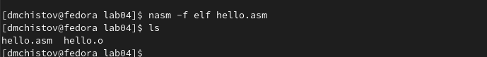{#fig:004 width=100%}

## Расширенный синтаксис командной строки NASM

Выполняю команду "nasm -o obj.o -f elf -g -l list.lst hello.asm", которая скомпилирует несколько требуемых файлов, после чего пишу команду ls, чтобы проверить успешность выполнения команды (рис. @fig:005).

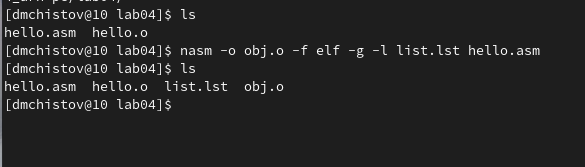{#fig:005 width=100%}

## Компоновщик LD 

Передаю объектный файл на обработку компоновщику командой ld, после чего проверяю, создался ли файл командой ls. (рис. @fig:006).

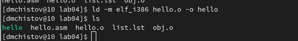{#fig:006 width=100%}

Затем выполняю следующую команду "ld -m elf_i386 obj.o -o main". У созданного файла будет имя "main", это можно подтвердить, прописав команду ls (рис. @fig:007).

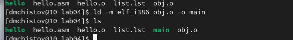{#fig:007 width=100%}

## Запуск исполняемого файла

Остаётся лишь запусть сгенерированный файл hello. Достаточно написать команду ./hello (рис. @fig:008).

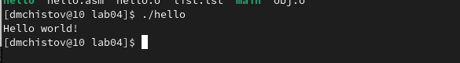{#fig:008 width=100%}

Код успешно был выполнен!

# Задание для самостоятельной работы

Копирую файл hello.asm и называю его lab04.asm командой cp (рис. @fig:009).

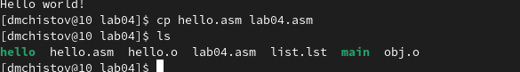{#fig:009 width=100%}

Вношу изменения в файл с помощью утилиты mcedit, чтобы при выполнении выводилось моё имя и фамилия (рис. @fig:010).

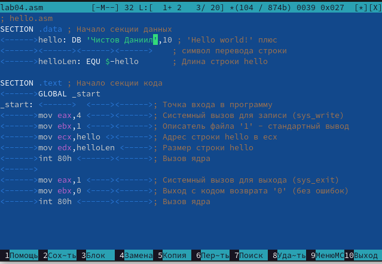{#fig:010 width=100%}

Преобразовываю сгенерированный файл в объект утилитой nasm, проверяю успешное выполнение команды утилитой ls (рис. @fig:011).

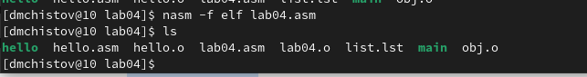{#fig:011 width=100%}

Отправка файл преобразованный файл объект компоновщику на преобразование в готовую программу (рис. @fig:012).

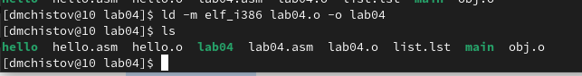{#fig:012 width=100%}

Запускаю готовый файл (рис. @fig:013).

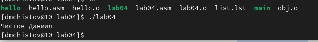{#fig:013 width=100%}

Копирую файлы hello.asm и lab04.asm в директорию labs/lab04 (рис. @fig:014).

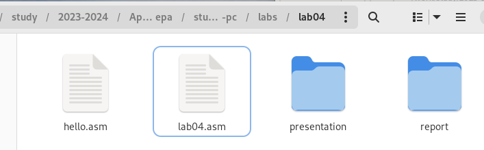{#fig:014 width=100%}

Вношу изменения в репозиторий Github, сначала заявляя о них командой git add, после чего заявляю об отправке изменений командой git commit, называя их "submitting .asm files to lab04" (рис. @fig:015).

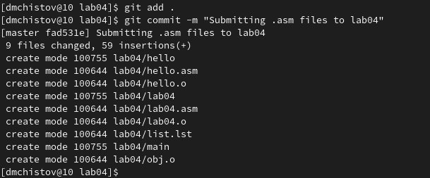{#fig:015 width=100%}

Отправляю изменения на сервер командой git push (рис. @fig:016).

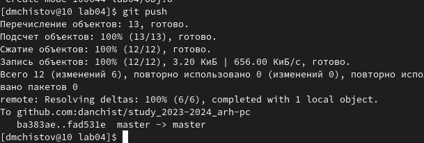{#fig:016 width=100%}

# Выводы

При выполнении работы, мной были получены навыки работы с программами, написанные на языке NASM, освоение их компиляции и сборки.

# Список литературы{.unnumbered}

[Лабораторная работы №4](https://esystem.rudn.ru/pluginfile.php/2089084/mod_resource/content/0/%D0%9B%D0%B0%D0%B1%D0%BE%D1%80%D0%B0%D1%82%D0%BE%D1%80%D0%BD%D0%B0%D1%8F%20%D1%80%D0%B0%D0%B1%D0%BE%D1%82%D0%B0%20%E2%84%964.%20%D0%A1%D0%BE%D0%B7%D0%B4%D0%B0%D0%BD%D0%B8%D0%B5%20%D0%B8%20%D0%BF%D1%80%D0%BE%D1%86%D0%B5%D1%81%D1%81%20%D0%BE%D0%B1%D1%80%D0%B0%D0%B1%D0%BE%D1%82%D0%BA%D0%B8%20%D0%BF%D1%80%D0%BE%D0%B3%D1%80%D0%B0%D0%BC%D0%BC%20%D0%BD%D0%B0%20%D1%8F%D0%B7%D1%8B%D0%BA%D0%B5%20%D0%B0%D1%81%D1%81%D0%B5%D0%BC%D0%B1%D0%BB%D0%B5%D1%80%D0%B0%20NASM.pdf)
