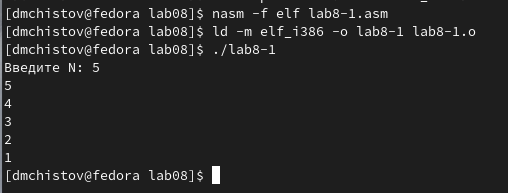
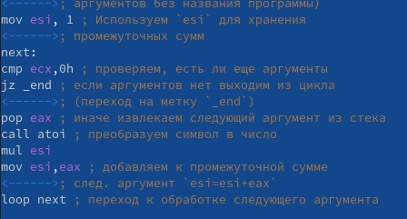

---
## Front matter
title: "Отчёт по лабораторной работе №8"
subtitle: "Дисциплина: Архитектура компьютеров и операционные системы"
author: "Чистов Даниил Максимович"

## Generic options
lang: ru-RU
toc-title: "Содержание"

## Bibliography
bibliography: bib/cite.bib
csl: pandoc/csl/gost-r-7-0-5-2008-numeric.csl

## Pdf output format
toc: true # Table of contents
toc-depth: 2
lof: true # List of figures
lot: false # List of tables
fontsize: 12pt
linestretch: 1.5
papersize: a4
documentclass: scrreprt
## I18n polyglossia
polyglossia-lang:
  name: russian
  options:
	- spelling=modern
	- babelshorthands=true
polyglossia-otherlangs:
  name: english
## I18n babel
babel-lang: russian
babel-otherlangs: english
## Fonts
mainfont: PT Serif
romanfont: PT Serif
sansfont: PT Sans
monofont: PT Mono
mainfontoptions: Ligatures=TeX
romanfontoptions: Ligatures=TeX
sansfontoptions: Ligatures=TeX,Scale=MatchLowercase
monofontoptions: Scale=MatchLowercase,Scale=0.9
## Biblatex
biblatex: true
biblio-style: "gost-numeric"
biblatexoptions:
  - parentracker=true
  - backend=biber
  - hyperref=auto
  - language=auto
  - autolang=other*
  - citestyle=gost-numeric
## Pandoc-crossref LaTeX customization
figureTitle: "Рис."
tableTitle: "Таблица"
listingTitle: "Листинг"
lofTitle: "Список иллюстраций"
lotTitle: "Список таблиц"
lolTitle: "Листинги"
## Misc options
indent: true
header-includes:
  - \usepackage{indentfirst}
  - \usepackage{float} # keep figures where there are in the text
  - \floatplacement{figure}{H} # keep figures where there are in the text
---

# Цель работы

Цель данной работы - приобретение навыков написания программ с использованием циклов и обработкой аргументов командной строки.

# Задание

- Реализация циклов в NASM
- Обработка аргументов командной строки
- Задание для самостоятельной работы

# Выполнение лабораторной работы

## Реализация циклов в NASM
Создаю каталог для программ лабораторной работы №8, затем создаю файл lab8-1.asm (рис. @fig:001).

{#fig:001 width=100%}

Открываю созданный мной файл в mcedit и вставляю код из листинга 8.1 (рис. @fig:002).

{#fig:002 width=100%}

Создаю исполняемый файл и проверяю его работу (рис. @fig:003).

{#fig:003 width=100%}

Изменяю код, воспользовавшись кодом, приведённом в задании (рис. @fig:004), затем проверяю его работу (рис. @fig:005).

{#fig:004 width=100%}

{#fig:005 width=100%}

Данный пример показал, что использование регистра ecx в теле цикла loop может привести к некорректной работе программы. Программа просто выводит бесконечный набор чисел.

Теперь попытаюсь корректно испольщовать регистр ecx, воспользовавшись предоставленным заданием кодом. (рис. @fig:006) и также проверяю корректность работы программы (рис. @fig:007).

{#fig:006 width=100%}

{#fig:007 width=100%}

Успешно! В данном случае количество выводой соотвествует с введёным числом N.

## Обработка аргументов командной строки

Внимательно изучаю код из листинга 8.2, после чего создаю файл lab8-2.asm  (рис. @fig:008), вставляю код (рис. @fig:009), создаю файл и указываю следующие аргументы: аргумент1 аргумент 2 'аргумент 3'  (рис. @fig:010)

{#fig:008 width=100%}

{#fig:009 width=100%}

{#fig:010 width=100%}

Программа работает успешно!

Теперь создаю новый файл - lab8-3.asm  (рис. @fig:011), и ввожу в него код из листинга 8.3  (рис. @fig:012).

{#fig:011 width=100%}

{#fig:012 width=100%}

Создаю файл и указываю аргументы такие же, как в приведённом примере: 12 13 7 10 5  (рис. @fig:013).

{#fig:013 width=100%}

Программа работает успешно!

Теперь от меня требуется изменить код программы 8-3 таким образом, чтобы вместо суммирования аргументов было выполнено произведение. Для этого воспользуюсь обозначением mul, а также перед этим изменю значение esi с 0 на 1, таким образом программа будет умножать каждый аргумент на следующий. Приведу изменённый код программы (рис. @fig:014).

{#fig:014 width=100%}

Проверяю корректность работы программы (рис. @fig:015).

{#fig:015 width=100%}

## Задание для самостоятельной работы
От меня требуется написать программу, которая суммирует значения определённой функции f(x). Так как мой вариант - 2, моя функция выглядит следующим образом:

$f(x) = 3x-1$

Вот готовый код программы в виде скриншота (рис. @fig:016).

{#fig:016 width=100%}

Вот код в письменном виде:

%include 'in_out.asm'

SECTION .data

msg1 db "Функция: f(x)=3x-1 ", 0x0A

msg2 db "Результат: "

SECTION .text

global _start

_start:

pop ecx ; Извлекаем из стека в `ecx` количество

	; аргументов (первое значение в стеке)
	
pop edx ; Извлекаем из стека в `edx` имя программы

	; (второе значение в стеке)
	
sub ecx,1 ; Уменьшаем `ecx` на 1 (количество

	; аргументов без названия программы)
	
mov esi, 0 ; Используем `esi` для хранения

	; промежуточных сумм
	
mov ebx, 3 ; Храним 3, как один из операндов в ф-ии f(x)

next:

cmp ecx,0h ; проверяем, есть ли еще аргументы

jz _end ; если аргументов нет выходим из цикла

	; (переход на метку `_end`)
	
pop eax ; иначе извлекаем следующий аргумент из стека

call atoi ; преобразуем символ в число

mul eax

mov ebx, eax ; умножаем x на 3

sub ebx, 1 ; вычитаем 1

add esi, ebx ; добавляем готовый результат к общей сумме

loop next ; переход к обработке следующего аргумента

 
_end:

mov eax, msg1 

call sprint

mov eax, esi ; записываем сумму в регистр `eax`

call iprintLF ; печать результата

call quit ; завершение программы

Теперь нужно проверить корректность работы моего кода  (рис. @fig:017).

{#fig:017 width=100%}

# Выводы

Я выполнил поставленные цели лабораторной работы, благодаря этому я приобрёл навыки написания программ с использованием циклов и обработкой аргументов командной строки.

# Список литературы{.unnumbered}

[Лабораторная работы №8](https://esystem.rudn.ru/pluginfile.php/2089095/mod_resource/content/0/%D0%9B%D0%B0%D0%B1%D0%BE%D1%80%D0%B0%D1%82%D0%BE%D1%80%D0%BD%D0%B0%D1%8F%20%D1%80%D0%B0%D0%B1%D0%BE%D1%82%D0%B0%20%E2%84%968.%20%D0%9F%D1%80%D0%BE%D0%B3%D1%80%D0%B0%D0%BC%D0%BC%D0%B8%D1%80%D0%BE%D0%B2%D0%B0%D0%BD%D0%B8%D0%B5%20%D1%86%D0%B8%D0%BA%D0%BB%D0%B0.%20%D0%9E%D0%B1%D1%80%D0%B0%D0%B1%D0%BE%D1%82%D0%BA%D0%B0%20%D0%B0%D1%80%D0%B3%D1%83%D0%BC%D0%B5%D0%BD%D1%82%D0%BE%D0%B2%20%D0%BA%D0%BE%D0%BC%D0%B0%D0%BD%D0%B4%D0%BD%D0%BE%D0%B9%20%D1%81%D1%82%D1%80%D0%BE%D0%BA%D0%B8..pdf)

