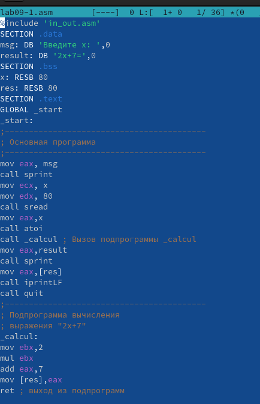
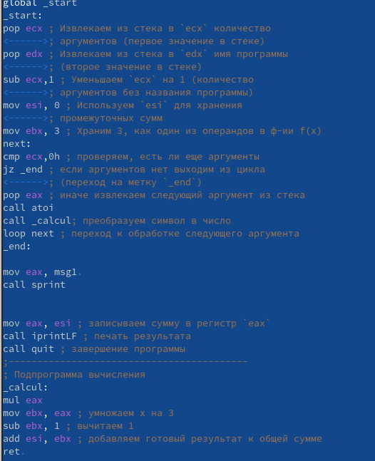

---
## Front matter
title: "Лабораторная работа №9"
subtitle: "Дисциплина: Архитектура компьютеров и операционные системы"
author: "Чистов Даниил Максимович"

## Generic otions
lang: ru-RU
toc-title: "Содержание"

## Bibliography
bibliography: bib/cite.bib
csl: pandoc/csl/gost-r-7-0-5-2008-numeric.csl

## Pdf output format
toc: true # Table of contents
toc-depth: 2
lof: true # List of figures
lot: false # List of tables
fontsize: 12pt
linestretch: 1.5
papersize: a4
documentclass: scrreprt
## I18n polyglossia
polyglossia-lang:
  name: russian
  options:
	- spelling=modern
	- babelshorthands=true
polyglossia-otherlangs:
  name: english
## I18n babel
babel-lang: russian
babel-otherlangs: english
## Fonts
mainfont: PT Serif
romanfont: PT Serif
sansfont: PT Sans
monofont: PT Mono
mainfontoptions: Ligatures=TeX
romanfontoptions: Ligatures=TeX
sansfontoptions: Ligatures=TeX,Scale=MatchLowercase
monofontoptions: Scale=MatchLowercase,Scale=0.9
## Biblatex
biblatex: true
biblio-style: "gost-numeric"
biblatexoptions:
  - parentracker=true
  - backend=biber
  - hyperref=auto
  - language=auto
  - autolang=other*
  - citestyle=gost-numeric
## Pandoc-crossref LaTeX customization
figureTitle: "Рис."
tableTitle: "Таблица"
listingTitle: "Листинг"
lofTitle: "Список иллюстраций"
lotTitle: "Список таблиц"
lolTitle: "Листинги"
## Misc options
indent: true
header-includes:
  - \usepackage{indentfirst}
  - \usepackage{float} # keep figures where there are in the text
  - \floatplacement{figure}{H} # keep figures where there are in the text
---

# Цель работы

Цель работы - Приобретение навыков написания программ с использованием подпрограмм и знакомство с методами отладки при помощи GDB и его основными возможностями.

# Задание

- Выполнение Лабораторной работы
- Задание для самостоятельной работы

# Выполнение лабораторной работы
## Реализация подпрограмм в NASM
Создаю каталог для выполнения лабораторной работы, а потом создаю файл lab09-1.asm (рис. @fig:001).

{#fig:001 width=100%}

Вставляю в созданный файл код (рис. @fig:002).

{#fig:002 width=100%}

Создаю файл и проверяю его работу (рис. @fig:003).

{#fig:003 width=100%}

Изменяю код программы, добавив подпрограмму _subcalcul (рис. @fig:004).

{#fig:004 width=100%}

Создаю файл и проверяю его работу (рис. @fig:005).

{#fig:005 width=100%}

## Отладка программам с помощью GDB

Создаю файл lab09-2.asm, а затем вставляю код из листинга 9.2 (рис. @fig:006).

{#fig:006 width=100%}

Начинаю открывать файл в GDB (рис. @fig:007).

{#fig:007 width=100%}

Проверяю работу программы (рис. @fig:008).

{#fig:008 width=100%}

Ставлю метку у кода _start (рис. @fig:009).

{#fig:009 width=100%}

Дисассимилирую код с помощью команды diassemble (рис. @fig:010).

{#fig:010 width=100%}

Переключаюсь на отображение команд с Intel’овским синтаксисом, введя команду set
disassembly-flavor intel (рис. @fig:011).

{#fig:011 width=100%}

Имена регистров в режиме ATT начинаются с символа %, а имена операндов – с $, в то время как в синтаксисе Intel используется более привычный формат.

Включаю специальные режимы отображения (рис. @fig:012), (рис. @fig:013).

{#fig:012 width=100%}

{#fig:013 width=100%}

## Добавление точек останова
Проверяю наличие точек останова командой info breakpoints (рис. @fig:014).

{#fig:014 width=100%}

Определяю адрес инструкции mov ebx,0x0, а затем устанавливаю точку останова с помощью команды break (рис. @fig:015).

{#fig:015 width=100%}

## Работа с данными программы в GDB

С помощью команды si выполняю пять инструкций, затем проверяю значения каких регистров меняются (рис. @fig:016).

{#fig:016 width=100%}

Значения регистров eax, ecx, edx и ebx были изменены.

Просматриваю значения регистров с помощью команды info registers (рис. @fig:017).

{#fig:017 width=100%}

Просматриваю значение переменной msg1 и msg2 (рис. @fig:018).

{#fig:018 width=100%}

Изменения значений переменных msg1 и msg2 с помощью команды set (рис. @fig:019).

{#fig:019 width=100%}

Теперь вывожу значения регистра edx в различных форматах (рис. @fig:020).

{#fig:020 width=100%}

Команда вывода p/s $ebx различается в том, что при первой мы преобразуем символ в его текстовое представление, в то время как при второй - числовое значение в строковом виде остается неизменным.

Завершаю работу программы с помощью команды c, после чего выхожу из GDB с помощью команды q (рис. @fig:021).

{#fig:021 width=100%}

##  Обработка аргументов командной строки в GDB

Копирую файл lab8-2.asm, а затем компилирую его (рис. @fig:022).

{#fig:022 width=100%}

Загружаюсь в gdb перед этим указав аргументы (рис. @fig:023).

{#fig:023 width=100%}

Просматриваю позиции стека по адресу [esp+4], [esp+8], [esp+12] и т.д. (рис. @fig:024).

{#fig:024 width=100%}

Шаг изменения адреса составляет 4, поскольку количество аргументов в командной строке также равно 4.

# Задание для самостоятельной работы

## Задание 1

Копирую программу из задания 1 лабораторной работы №8, а затем изменяю её, реализовав  вычисление значения функции f(x) как подпрограмму (рис. @fig:025).

{#fig:025 width=100%}

Проверяю работу программы (рис. @fig:026).

{#fig:026 width=100%}

Код программы: 
%include 'in_out.asm'
SECTION .data
msg1 db "Функция: f(x)=3x-1 ", 0x0A
msg2 db "Результат: "
SECTION .text
global _start
_start:
pop ecx ; Извлекаем из стека в `ecx` количество
	; аргументов (первое значение в стеке)
pop edx ; Извлекаем из стека в `edx` имя программы
	; (второе значение в стеке)
sub ecx,1 ; Уменьшаем `ecx` на 1 (количество
	; аргументов без названия программы)
mov esi, 0 ; Используем `esi` для хранения
	; промежуточных сумм
mov ebx, 3 ; Храним 3, как один из операндов в ф-ии f(x)
next:
cmp ecx,0h ; проверяем, есть ли еще аргументы
jz _end ; если аргументов нет выходим из цикла
	; (переход на метку `_end`)
pop eax ; иначе извлекаем следующий аргумент из стека
call atoi
call _calcul; преобразуем символ в число
loop next ; переход к обработке следующего аргумента
_end:

mov eax, msg1 
call sprint

mov eax, esi ; записываем сумму в регистр `eax`
call iprintLF ; печать результата
call quit ; завершение программы
;------------------------------------------
; Подпрограмма вычисления
_calcul:
mul eax
mov ebx, eax ; умножаем x на 3
sub ebx, 1 ; вычитаем 1
add esi, ebx ; добавляем готовый результат к общей сумме
ret 

## Задание 2

Открываю код программы из листинга 9.3 (рис. @fig:027).

{#fig:027 width=100%}

Проверяю работу программы, результат должен быть равен 25 (рис. @fig:028).

{#fig:028 width=100%}

Программа выводит неправильный результат, нужно искать ошибку. Компилирую код для работы с gdb, затем запускаю её (рис. @fig:029).

{#fig:029 width=100%}

Ставлю точку останова с момента _start (рис. @fig:030).

{#fig:030 width=100%}

Начинаю следить за значениями переменных. 
На (рис. @fig:031), (рис. @fig:032) и (рис. @fig:033) всё идёт хорошо. 

{#fig:031 width=100%}

{#fig:032 width=100%}

{#fig:033 width=100%}

А вот в этом моменте явно происходит ошибка, происходит перемножение значений переменных eax и ecx, а должно ecx и ebx (рис. @fig:034).

{#fig:034 width=100%}

Чтобы исправить ошибку, мы добавляем после `add ebx, eax` строку `mov eax, ebx` и заменяем `ebx` на `eax` в инструкциях `add eax, 5` и `mov edi, eax` (рис. @fig:035).

{#fig:035 width=100%}

Проверяю работу программы (рис. @fig:036).

{#fig:036 width=100%}

Код программы: 
%include 'in_out.asm'
SECTION .data
div: DB 'Результат: ',0
SECTION .text
GLOBAL _start
_start:
; ---- Вычисление выражения (3+2)*4+5
mov ebx,3
mov eax,2
add ebx,eax
mov eax,ebx
mov ecx,4
mul ecx
add eax,5
mov edi,eax
; ---- Вывод результата на экран
mov eax,div
call sprint
mov eax,edi
call iprintLF
call quit

# Выводы

Благодаря выполнению работы, я научился приобретению навыков написания программ с использованием подпрограмм и познакомился с методами отладки при помощи GDB и его основными возможностями.

# Список литературы{.unnumbered}

[Лабораторная работы №9](https://esystem.rudn.ru/pluginfile.php/2089096/mod_resource/content/0/%D0%9B%D0%B0%D0%B1%D0%BE%D1%80%D0%B0%D1%82%D0%BE%D1%80%D0%BD%D0%B0%D1%8F%20%D1%80%D0%B0%D0%B1%D0%BE%D1%82%D0%B0%20%E2%84%969.%20%D0%9F%D0%BE%D0%BD%D1%8F%D1%82%D0%B8%D0%B5%20%D0%BF%D0%BE%D0%B4%D0%BF%D1%80%D0%BE%D0%B3%D1%80%D0%B0%D0%BC%D0%BC%D1%8B.%20%D0%9E%D1%82%D0%BB%D0%B0%D0%B4%D1%87%D0%B8%D0%BA%20..pdf)
