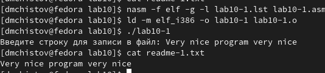

---
## Front matter
title: "Лабораторная работа №10"
subtitle: "Дисциплина: Архитектура компьютеров и операционные системы"
author: "Чистов Даниил Максимович"

## Generic otions
lang: ru-RU
toc-title: "Содержание"

## Bibliography
bibliography: bib/cite.bib
csl: pandoc/csl/gost-r-7-0-5-2008-numeric.csl

## Pdf output format
toc: true # Table of contents
toc-depth: 2
lof: true # List of figures
lot: false # List of tables
fontsize: 12pt
linestretch: 1.5
papersize: a4
documentclass: scrreprt
## I18n polyglossia
polyglossia-lang:
  name: russian
  options:
	- spelling=modern
	- babelshorthands=true
polyglossia-otherlangs:
  name: english
## I18n babel
babel-lang: russian
babel-otherlangs: english
## Fonts
mainfont: PT Serif
romanfont: PT Serif
sansfont: PT Sans
monofont: PT Mono
mainfontoptions: Ligatures=TeX
romanfontoptions: Ligatures=TeX
sansfontoptions: Ligatures=TeX,Scale=MatchLowercase
monofontoptions: Scale=MatchLowercase,Scale=0.9
## Biblatex
biblatex: true
biblio-style: "gost-numeric"
biblatexoptions:
  - parentracker=true
  - backend=biber
  - hyperref=auto
  - language=auto
  - autolang=other*
  - citestyle=gost-numeric
## Pandoc-crossref LaTeX customization
figureTitle: "Рис."
tableTitle: "Таблица"
listingTitle: "Листинг"
lofTitle: "Список иллюстраций"
lotTitle: "Список таблиц"
lolTitle: "Листинги"
## Misc options
indent: true
header-includes:
  - \usepackage{indentfirst}
  - \usepackage{float} # keep figures where there are in the text
  - \floatplacement{figure}{H} # keep figures where there are in the text
---

# Цель работы

Цель работы - Приобретение навыков написания программ для работы с файлами.

# Задание

- Порядок выполнения лабораторной работы
- Задание для самостоятельной работы

# Выполнение лабораторной работы

Создаю каталог для программ лабораторной работы №10, а затем создаю файлы lab10-1.asm, readme-1.txt, readme-2.txt (рис. @fig:001).

{#fig:001 width=100%}

Теперь в файл lab10-1.asm вставляю код из листинга 10.1 (рис. @fig:002).

{#fig:002 width=100%}

Собираю файл и проверяю корректность его работы (рис. @fig:003).

{#fig:003 width=100%}

С помощью команды chmod изменяю права доступа к исполняемому файлу lab10-1, после чего проверяю успешность своих операций (рис. @fig:004).

{#fig:004 width=100%}

Теперь с помощью команды chmod изменяю права доступа к исходному файлу lab10-1.asm, а потом проверяю сделал ли всё верно (рис. @fig:005).

{#fig:005 width=100%}

От меня требуется предоставить права к файлу readme-1.txt в символьном виде, а для файла readme-2.txt - в двоичном виде. Мой вариант - 2, после выполнения проверю командой ls -l свою работу (рис. @fig:006).

{#fig:006 width=100%}

# Задание для самостоятельной работы

От меня требуется написать программу, которая работает следующим образом:
    - Вывод приглашения “Как Вас зовут?”
    - ввести с клавиатуры свои фамилию и имя
    - создать файл с именем name.txt
    - записать в файл сообщение “Меня зовут”
    - дописать в файл строку введенную с клавиатуры
    - закрыть файл

Создаю файл для написания кода (рис. @fig:007).

{#fig:007 width=100%}

Записываю код программы, для удобства воспользуюсь командами из файла in_out.asm (рис. @fig:008), (рис. @fig:009).

{#fig:008 width=100%}

{#fig:009 width=100%}

Собираю программу и проверяю её работу (рис. @fig:010).

{#fig:010 width=100%}

Код программы:

    %include "in_out.asm"
    SECTION .data
    msg1 db "Как вас зовут?", 0h
    output_file db "result.txt", 0h
    msg2 db "Меня зовут ", 0h
    
    SECTION .bss
    user_input resb 255
    
    SECTION .text
    global _start
    _start:
        mov eax, msg1
        call sprintLF

        mov ecx, user_input
        mov edx, 255
        call sread

        mov ecx, 0777o
        mov ebx, output_file
        mov eax, 8
        int 80h

        mov ecx, 2
        mov ebx, output_file
        mov eax, 5
        int 80h

        mov esi, eax

        mov eax, msg2
        call slen
        mov edx, eax
        mov ecx, msg2
        mov ebx, esi
        mov eax, 4
        int 80h

        mov eax, user_input
        call slen
        mov edx, eax
        mov ecx, user_input
        mov ebx, esi
        mov eax, 4
        int 80h

        mov ebx, esi
        mov eax, 6
        int 80h

        call quit

# Выводы

Выполнив данную лабораторную работу, я приобрёл навыки работы с файлами, а также закрепил свои знания по программированию на языке asm.

# Список литературы{.unnumbered}

[Лабораторная работа #10](https://esystem.rudn.ru/pluginfile.php/2089097/mod_resource/content/0/%D0%9B%D0%B0%D0%B1%D0%BE%D1%80%D0%B0%D1%82%D0%BE%D1%80%D0%BD%D0%B0%D1%8F%20%D1%80%D0%B0%D0%B1%D0%BE%D1%82%D0%B0%20%E2%84%9610.%20%D0%A0%D0%B0%D0%B1%D0%BE%D1%82%D0%B0%20%D1%81%20%D1%84%D0%B0%D0%B9%D0%BB%D0%B0%D0%BC%D0%B8%20%D1%81%D1%80%D0%B5%D0%B4%D1%81%D1%82%D0%B2%D0%B0%D0%BC%D0%B8%20Nasm.pdf)
